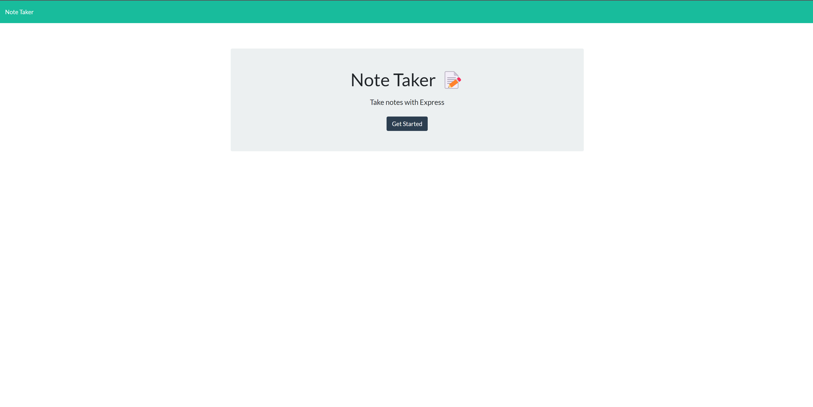
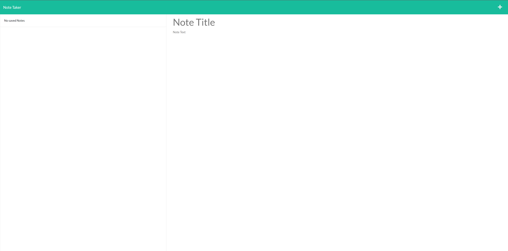

# Note Taker

## Description

This is a simple web application that employs routing and allows users to enter notes. The user will initially be given a landing page with a get started button. Once the button is pressed they will have a interactive note menu. The note menu allows users to view previously stored notes, make new notes or delete notes. Currently this is not user specific so the information will be visible to anyone who views the deployed page.

Link to deployed page: [https://note-taker-meanbean87-efbe9059d3bf.herokuapp.com/](https://note-taker-meanbean87-efbe9059d3bf.herokuapp.com/)

From a development perspective this application requires "Node.js", "Express.js" installation as well as "uuid" installation.

Node can be installed directly from [https://nodejs.org/en](https://nodejs.org/en).

Express.js can be installed via "npm i express --save"  [https://expressjs.com/](https://expressjs.com/)

UUID package to generate unique IDs which can be installed using "npm i uuid" [https://www.npmjs.com/package/uuid](https://www.npmjs.com/package/uuid)

Or all packages can be installed using "npm install" while in the remote directory in CLI.

This was a project during the Full Stack Web Development Bootcamp at UC Berkeley Ext.

#### Landing Page Photo:



#### Notes Page:



## Installation

For Development:

1. Clone or fork the repository using "git@github.com:MeanBean87/note-taker.git"
2. Navigate to the root directory of the project using CLI.
3. Install node modules using "npm install"

## Usage

1. Visit the deployed page: [https://note-taker-meanbean87-efbe9059d3bf.herokuapp.com/](https://note-taker-meanbean87-efbe9059d3bf.herokuapp.com/)
2. Hit the get started button.
3. The main pane will display "Note Title", and "Note Text".
4. The side pane will show previously saved notes, or "No saved Notes" if none are saved currently.
5. Click on "Note Title" in the main pain and enter a title for your note.
6. Click on "Note Text" to add note information specific to the title.
7. A save icon will appear automatically in the top right corner of the nav bar. Click that to save the note.
8. The saved note will then appear in the side panel, to review that note click on the note in the side bar.
9. Click on the red trash can icon to delete the note.

## Code Highlights

Snippet a post method.

```
app.post("/api/notes", async (req, res) => {
  try {
    const newNote = req.body;
    newNote.id = uuidv4();
    const notes = await readNotes();
    notes.push(newNote);
    fs.writeFileSync("./db/db.json", JSON.stringify(notes));
    res.json(notes);
  } catch (err) {
    console.error("Error writing db.json", err);
    res.status(500).json({ error: "Failed to write note" });
  }
});
```

## Learning Points

This was a demonstration of the capabilities of using Express.js to perform routing. And performing basic CRUD within a server environment.

## Badges

[](https://developer.mozilla.org/en-US/docs/Web/JavaScript) [](https://nodejs.org/) [](https://git-scm.com/) [](https://github.com/MeanBean87)  

## Author

Michael Mattingly

* [GitHub](https://github.com/MeanBean87)
* [LinkedIn](https://www.linkedin.com/in/michael-mattingly-5580b1280/)

This project was created with source code provided from UC Berkeley Extension.

This project uses the "UUID" package: [github.com/uuidjs/uuid#readme](https://github.com/uuidjs/uuid#readme)

This project uses "Express.js" package: [https://expressjs.com/]()

## License

This project is licensed under the [MIT License](https://github.com/MeanBean87/readme-generator/blob/main/LICENSE). Please refer to the LICENSE file for more details.
